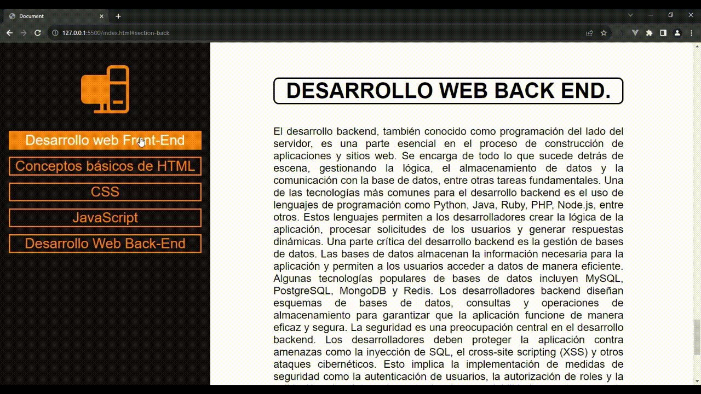

# FAQ HTML CSS

Ejercicio propuesto por la Bootcamp FactoriaF5 para practicar HTML y CSS.

## Resultado de la web :heavy_check_mark:

## Objetivos :dart:
- Crear una web que tenga 5 secciones.
- Las secciones deben hablar de los siguientes temas:
    1. Desarrollo web Front-end.
    2. Conceptos básicos de HTML.
    3. CSS.
    4. JavaScript.
    5. Desarrollo web Back-end.

## Requisitos :pencil:
- El ejercicio debe estar en un repositorio de GitHub.
- El resultado debe estar desplegado en GitHub Pages.

## Conceptos tratados :book:
### HTML
- Estructura básica de HTML.
- Enlaces a hojas de estilo.
- Encabezados.
- Imágenes.
- Párrafos.
- Creación de un navbar.
- Redirecciones a artículos.

### CSS
- Reseteo de estilos.
- Estilos de encabezado y subtítulos.
- Listas.
- Uso de flex.
- Uso de diferentes hojas de estilo con @import.
- Uso de root para paleta de colores.

## Tools :wrench:
|| [Visual Studio Code](https://code.visualstudio.com/) || 
[Live Server ](https://code.visualstudio.com/) ||
